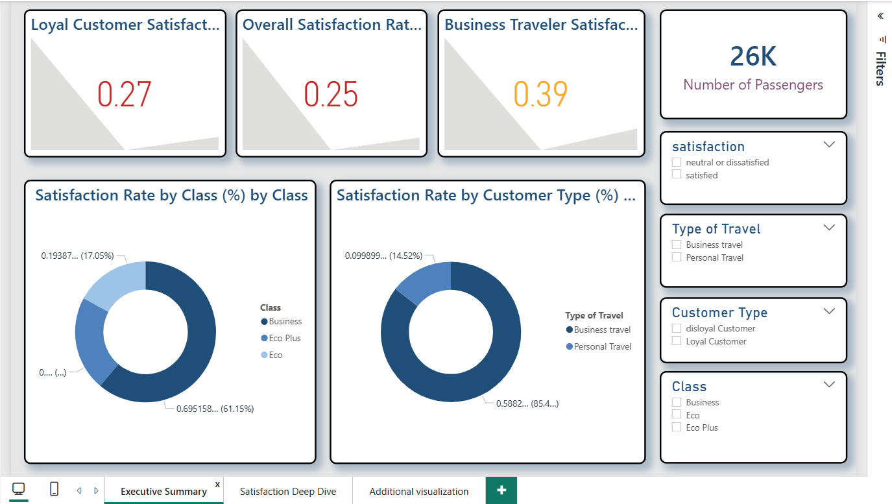
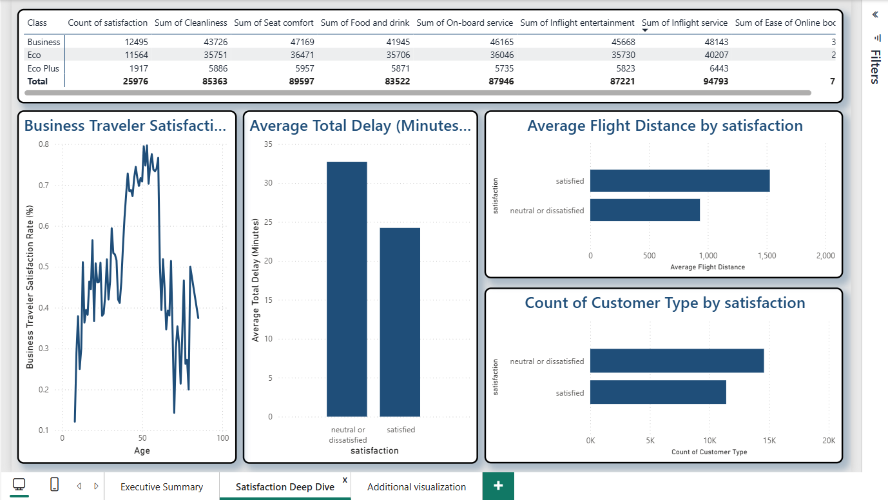
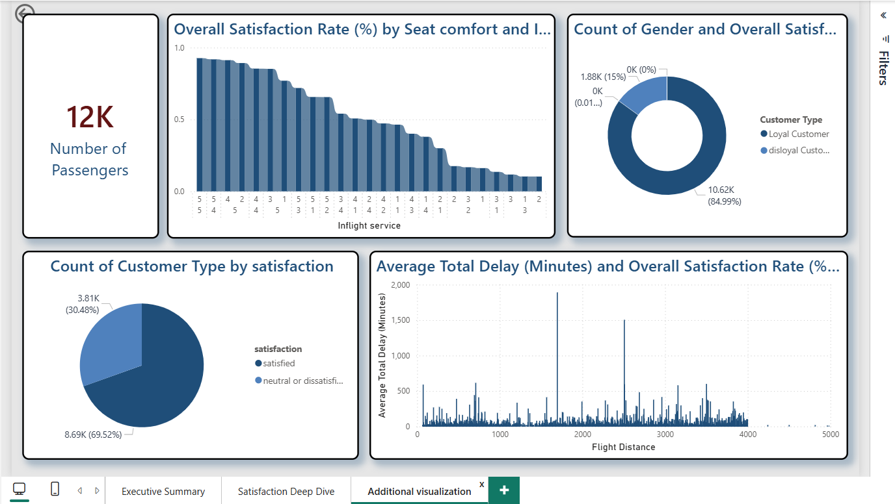

# Flight Passenger Satisfaction Analytics

## Project Overview
This Business Intelligence project analyzes airline passenger satisfaction using survey data from airline customers.

The objective is to identify the main drivers of customer satisfaction and transform operational flight data into actionable business insights using Power BI dashboards and data preparation with Python.

This repository is a **portfolio-optimized version** of an academic BI project redesigned for professional presentation.

---

##  Tech Stack
- Power BI (Dashboard & Data Modeling)
- Python (Pandas)
- Data Cleaning & Transformation
- Data Visualization
- Business Intelligence Analysis

---

##  Project Structure
data/
│ raw_data.csv
│ cleaned_data.csv

scripts/
│ data_cleaning.py

dashboard/
│ flight_satisfaction.pbix

images/
│ dashboard_overview.png
│ satisfaction_analysis.png
│ delay_analysis.png

---

##  Data Pipeline
1. Raw dataset imported from Kaggle (CSV format)
2. Data cleaned and preprocessed using Python
3. Clean dataset loaded into Power BI
4. Interactive dashboards built for analysis

---

##  Key Business Questions
- What factors most influence passenger satisfaction?
- How does satisfaction vary across travel classes?
- Do flight delays impact customer experience?
- Which airline services drive satisfaction?

---

## Key Performance Indicators 
-Overall Satisfaction Rate: 43.9%

-Satisfaction by Class (Business vs Economy)

-Satisfaction by Travel Type (Business vs Personal)

-Loyal vs Disloyal Customer Satisfaction

-Average Delay by Satisfaction Level

---

##  Business Recommendations

###  Improve Delay Management
Flight delays strongly reduce satisfaction. Airlines should prioritize operational efficiency and communication during disruptions.

###  Enhance Economy Class Experience
Economy passengers report lower satisfaction. Improving seating comfort and onboard services could significantly increase ratings.

###  Invest in Digital Experience
Online boarding and digital touchpoints show strong impact on satisfaction. Enhancing mobile and self-service solutions is recommended.

###  Focus on Inflight Services
Entertainment quality, cleanliness, and onboard service remain key satisfaction drivers.

###  Adopt Customer-Centric Strategy
Passenger segmentation enables targeted improvements and personalized service offerings.

---

##  Dashboard Preview

### Overview Dashboard

### Satisfaction Analysis

### Delay Impact Analysis

---

##  How to Reproduce
1. Clone repository:
   git clone https://github.com/Haitham920/flight-passenger-satisfaction-analytics.git
   
2. Install dependencies:
   pip install pandas

3. Run data preparation:
  python scripts/data_cleaning.py

4. Open Power BI dashboard:
 dashboard/flight_satisfaction.pbix

---

##  Author
Haitham Maatar  
Business Intelligence & Data Analytics Student

---

   
